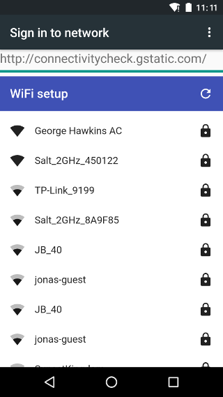

Captive portal
==============

When you connect to a commercial WiFi network, e.g. one provided by a coffee shop, you often have to go through a login process.

There's nothing very sophisticated about how this is achieved. When you first connect, you do not have full internet access and the network's DNS server responds to all DNS requests with the address of the web server serving the login page. This web server then redirects all unfound paths to the login page (rather than the usual behavior of returning `404 Not Found`).

So if you try to go to e.g. <https://news.ycombinator.com/item?id=22867627>, the network's DNS responds to `news.ycombinator.com` with the address of the login web server and then it redirects the request for `/item?id=22867627` to its login page.

For an end-user, trying to access a web page and then being redirected to a login page is a bit confusing so these days most OSes try to detect this upfront and immediately present the login page as part of the process of selecting the WiFi network.

They do this by probing for a URL that they know exists and which has a defined response, e.g. Android devices typically check for <http://connectivitycheck.gstatic.com/generate_204>. If they get the defined response, e.g. `204 No Content`, then they assume they have full internet access, if they get no response they know they're on a private network with no internet access and if they get a redirect they assume they're in a captive portal and prompt the user to login via the page that they're redirected to.

Each OS does things _slightly_ differently but for more on the fairly representative process used by Chromium see their [network portal detection](https://www.chromium.org/chromium-os/chromiumos-design-docs/network-portal-detection) documentation.

So the captive portal setup used by this project requires two things - a DNS server and a web server. Very lightweight implementations of both are used. These are derived from [MicroWebSrv2](https://github.com/jczic/MicroWebSrv2) and [MicroDNSSrv](https://github.com/jczic/MicroDNSSrv) (both by [Jean-Christophe Bos](https://github.com/jczic)).

Absolute redirects
------------------

Normally when you do a redirect, you redirect to a path, e.g. "/", rather than an absolute URL. However, if you do this in a captive portal setup then the hostname of the probe URL ends up being shown as the login URL.

E.g. if the probe URL is <http://connectivitycheck.gstatic.com/generate_204> and you redirect to "/" then the login URL is displayed as http&colon;//connectivitycheck.gstatic.com/ (see the first of the images here). Whereas if you redirect to an absolute URL then this gets displayed as the login URL (second image).

&nbsp;&nbsp;

There's no technical difference between the two - all hostnames resolve to the same address - but the fact that many captive portals simply redirect to a path means that no end of issues are logged with Google about failure to login to `connectivitycheck.gstatic.com` as the result of non-working portals all over the world (that have nothing to do with Google).

DNS spoofing
------------

On laptops and desktops, people often configure a fixed DNS server, e.g. [8.8.8.8](https://en.wikipedia.org/wiki/Google_Public_DNS). In such a setup the captive portal would have to spy on DNS traffic and spoof responses in order to achieve redirects. This is possible with the ESP32 (using [promiscuous mode](https://en.wikipedia.org/wiki/Promiscuous_mode)) but this capability is not currently exposed in MicroPython 1.12.
